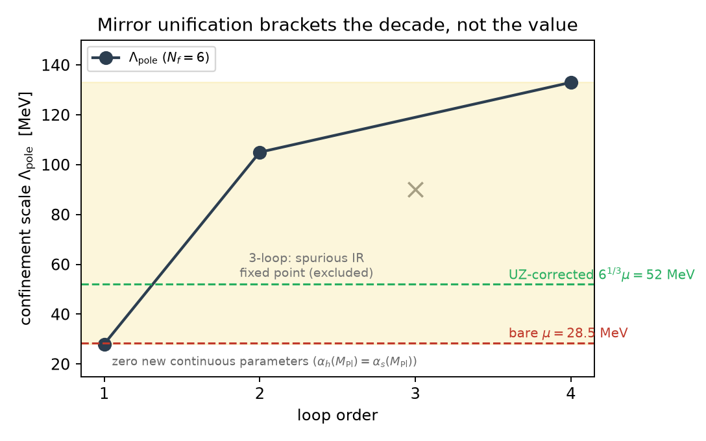
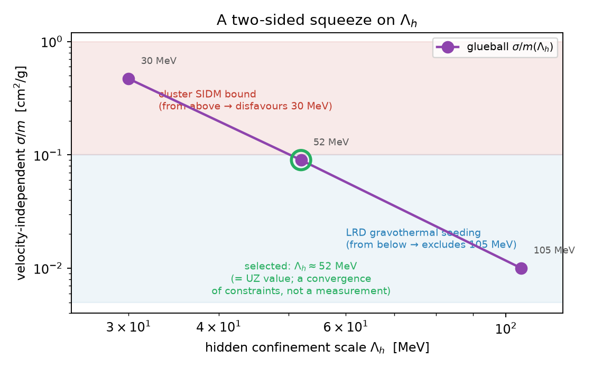

# The Scale Sector of a One-Sector Dark Cosmology: μ from Dimensional Transmutation and Glueball Dark Matter

**Author:** Stilian Pandev ([ORCID: 0009-0005-8153-071X](https://orcid.org/0009-0005-8153-071X))

**Date:** 2026-07-17 (preprint draft)

---

## Abstract

The SEDE dark-energy law $\rho_X = \mu^3 H$ requires a mass scale $\mu \approx 28.5$ MeV whose origin is the program's self-declared deepest open problem. We propose that $\mu$ is the confinement scale of a hidden $SU(3)$ sector generated by dimensional transmutation, and we report the results of a systematic assessment. A pure hidden Yang–Mills sector confining at $\mu$ requires $\alpha_h(M_{\rm Pl}) = 1/83.2$ — a log-natural coupling replacing a $10^{60}$ tuning, though the exponential map retains sensitivity $d\ln\Lambda/d\ln\alpha = 47.5$. A sharper variant, *mirror unification* ($\alpha_h(M_{\rm Pl}) = \alpha_s(M_{\rm Pl})$ with $N_f = 6$), introduces **zero new continuous parameters** and lands in the right decade: the loop/scheme band is 28–105 MeV at two loops and 28–133 MeV once three- and four-loop running is included. The three-loop calculation is deflationary: near the conformal-window edge the band is irreducibly $O(1)$-wide perturbatively, so discriminating the bare ($\Lambda_h = \mu$) from the Urban–Zhitnitsky-corrected ($\Lambda_h = 6^{1/3}\mu = 52$ MeV) coefficient is a lattice question. The dark-energy law itself is inherited via the (contested, unproven) Urban–Zhitnitsky contact term [@Urban:2009vy; @Urban:2009yg; @Ohta:2010in], which remains the single load-bearing conjecture. The same sector's glueballs supply dark matter via $3\to2$ cannibal freeze-out — a mass miracle, not an abundance miracle — with a velocity-independent self-interaction whose cluster bounds and a conditional Little-Red-Dot seeding bracket converge, as *constraints*, on $\Lambda_h \approx 52$ MeV. To pre-empt an apparent mismatch: the DE-amplitude scale ($\mu = 28.5$ MeV) and this DM confinement scale ($\Lambda_h = 52$ MeV) are the *same* sector, related by the Urban–Zhitnitsky coefficient $\Lambda_h = 6^{1/3}\mu$ — so $(\Lambda_h/\mu)^3 = 6$ is a *predicted*, lattice-testable topological factor, not an independent tuning. We enumerate falsifiers and tag every claim as derived, matched, or conjectured.

---

## 1. Introduction

The parent program of this paper is a one-sector dark cosmology (USC) joining two constructions through a single horizon-entropy ledger: ECCG, which generates the matter sector (baryogenesis and, in its original branch, an asymmetric dark-matter relic at $m_X = 1.78$ GeV), and SEDE, which generates dark energy through the law

$$\rho_X = \mu^3 H, \qquad \mu \approx 28.5\ \text{MeV}.$$

Everything in SEDE's phenomenology — the H-linear equation of state, the growth gate, the modified-growth signatures — descends from this one dimensionful input. The SEDE completion standard (v0.3, item #5) names the origin of $\mu$ as the deepest open problem of the construction: $28.5$ MeV corresponds to a vacuum energy density tuned to one part in $\sim 10^{60}$ against the Planck scale if put in by hand.

There is a natural candidate mechanism inside the corpus's own toolkit. ECCG generates its high scale $\Lambda_H$ by dimensional transmutation [@Coleman:1973jx] — the logarithmic running of a dimensionless gauge coupling from the Planck scale down to a confinement scale. Transmutation is the only known mechanism that converts an $O(1)$ dimensionless input into an exponentially suppressed dimensionful output without tuning:

$$\Lambda = M_{\rm Pl}\, e^{-2\pi / (b_0\, \alpha(M_{\rm Pl}))}.$$

This paper assesses the proposal that $\mu$ is the confinement scale $\Lambda_h$ of a hidden $SU(3)$ gauge sector, in two versions of increasing economy (a postulated coupling; a *mirror-unified* coupling with no new continuous input), together with the mechanism that would convert the *scale* into the *law* $\rho_X = \mu^3 H$ (the Urban–Zhitnitsky/Ohta topological vacuum energy), and the observation that the same sector's glueballs are a viable dark-matter candidate with distinctive, velocity-independent self-interactions.

The law $\rho_X = \mu^3 H$ is not itself new: it is the Urban–Zhitnitsky/Ohta QCD-ghost (Veneziano contact-term) dark-energy law $\rho_{\rm DE} \propto \Lambda^3 H$ [@Urban:2009vy; @Urban:2009yg; @Ohta:2010in; @Cai:2010uf], with the single substitution $\Lambda_{\rm QCD} \to \Lambda_{\rm hidden}$. Our contribution is not the law but (i) fixing the scale $\mu$ by dimensional transmutation of a hidden $SU(3)$, and (ii) tying the same sector to glueball dark matter. Notably the same $H$-linear form is reached from an entirely different route — a volume-law horizon entropy gives $\rho \propto H$ in entropic cosmology [@Komatsu:2015nkb; @Komatsu:2012zh], which is the route the SEDE cosmology companion takes — so $\rho \propto H$ is doubly-motivated (QCD contact term *and* horizon thermodynamics), a convergence rather than a coincidence. The parent QCD-topological-sector program remains active, and is being tested against current cosmological data [@VanWaerbeke:2025shm].

We are explicit throughout about the provenance of each claim: which quantities are *derived* (following from stated inputs by a reproducible calculation), which are *matched* to data (a computed number compared against an observed or required value), which are $O(1)$-controlled *estimates*, and which are *conjectures* (a mechanism whose validity is not established). Every numerical claim below carries its provenance; all are reproducible from the scripts listed in §10.

---

## 2. The transmutation mechanism

### 2.1 The coupling that does the job

For a pure hidden $SU(3)$ Yang–Mills sector ($b_0 = 11$), one-loop transmutation from the Planck scale gives

$$\frac{1}{\alpha_h(M_{\rm Pl})} = \frac{11}{2\pi} \ln\frac{M_{\rm Pl}}{\Lambda_h}.$$

Setting $\Lambda_h = \mu = 28.55$ MeV yields

$$\frac{1}{\alpha_h(M_{\rm Pl})} = 83.2, \qquad \alpha_h(M_{\rm Pl}) = 0.0120.$$

This is the same ballpark as the Standard Model couplings at $M_{\rm Pl}$ ($1/\alpha \sim 47$–$59$), though not equal to any of them. The check verifies exactly (`mu_transmutation_check.py`). The $10^{60}$ tuning in $\rho$ genuinely becomes a log-natural coupling specification.

We quote here the full Planck mass $M_{\rm Pl} = 1.22\times10^{19}$ GeV; the reduced-mass convention gives $1/\alpha \approx 80$. We therefore quote $1/\alpha_h(M_{\rm Pl}) \approx 80$–$83$, a convention band rather than a determination.

### 2.2 Sensitivity honesty

The transmutation map is exponential, and honesty requires stating its Jacobian:

$$\frac{d\ln\Lambda_h}{d\ln\alpha_h} = \ln\frac{M_{\rm Pl}}{\Lambda_h} = 47.5.$$

A 1% specification of $\alpha_h(M_{\rm Pl})$ fixes $\mu$ only to $\sim 48\%$ (a factor 1.6); pinning $\mu$ to 1% would require $\alpha_h$ specified to 0.02%. The correct statement is therefore: **transmutation naturalizes the scale; the precise value of $\mu$ remains a mild, log-level selection** unless the coupling itself is fixed by a principle. That principle is the subject of §3.

---

## 3. Mirror unification: zero new continuous parameters in, an O(1) band out

### 3.1 The construction

Rather than postulating $\alpha_h$, demand that the hidden coupling *equal the visible QCD coupling at the Planck scale* — the coupling-inheritance structure familiar from mirror/twin constructions [@Chacko:2005pe]:

$$\alpha_h(M_{\rm Pl}) = \alpha_s(M_{\rm Pl}).$$

Running the measured $\alpha_s(M_Z) = 0.1181$ up at two loops (with the $N_f\,5\to6$ threshold at $m_t$) gives $\alpha_s(M_{\rm Pl}) = 0.01886$, i.e. $1/\alpha = 53.0$. The hidden confinement scale is then fixed entirely by the *discrete* flavor content of the mirror sector. At one loop (`mu_transmutation_check.py`):

| hidden $SU(3)$ content | $\Lambda_h$ (one loop) |
|---|---|
| $N_f = 0$ | $1.2\times10^{6}$ MeV |
| $N_f = 3$ | $1.6\times10^{3}$ MeV |
| **$N_f = 6$** | **$\sim$30–46 MeV** |
| $N_f = 7$ | $0.3$ MeV |

A mirror QCD with six light flavors and a Planck-unified coupling confines within a factor $\sim 2$ of $\mu$, with **no new dimensionless inputs**: the coupling is inherited and $N_f$ is discrete. This is the strongest form of the proposal, and the "zero new continuous parameters" claim attaches precisely here — **to the input**. It does *not* attach to the output, as the next two subsections make quantitative.

### 3.2 Two-loop refinement: the single number dissolves into a band

The two-loop calculation with thresholds (`mu_transmutation_steps.py`) supersedes the early one-loop quote of "$\Lambda_h \approx 46$ MeV":

| scheme / order | $\Lambda_h$ |
|---|---|
| 1-loop pole | **27.6 MeV** |
| 2-loop pole | 105 MeV |
| 2-loop $\overline{\rm MS}$-form | 88 MeV |
| *(targets)* | bare $\mu = 28.5$ · UZ-corrected $6^{1/3}\mu = 51.9$ |

Two honest conclusions. (i) Mirror unification with $N_f = 6$ **robustly lands in the right decade with zero new continuous parameters** — a consistency check that the mirror hypothesis is not excluded. $N_f = 6$ is the flavor content selected to land in the decade ($N_f = 5, 7$ miss by orders of magnitude); given $\alpha_s(M_{\rm Pl}) \sim 1/53$ and $d\ln\Lambda/d\ln\alpha \approx 47.5$, hitting the decade was near-automatic — a consistency check, not a prediction. (ii) The loop/scheme spread ($\times 2$ each way, band $\approx$ 28–105 MeV) **cannot distinguish** the bare coefficient ($\Lambda_h = \mu$) from the UZ-corrected one ($\Lambda_h = 6^{1/3}\mu$, §4). An earlier claim of "12% alignment" with the UZ target was premature and is retracted: the band brackets *both* targets.

### 3.3 The three-loop result: deflationary, and instructively so

The scheme-fixed three-loop (and four-loop) running was computed as Tier-1 item #2 (`mirror_qcd_3loop.py`), with the explicit question of whether it tightens the band. It does not:

| loop order | $\Lambda_{\rm pole}$ |
|---|---|
| 1 | 28 MeV |
| 2 | 105 MeV |
| 3 | spurious IR fixed point — $\beta$ develops a zero at $a \approx 0.28$ ($\alpha \approx 3.5$), outside perturbative control |
| 4 | 133 MeV |

**The three-loop does not tighten the band; it reveals why no perturbative order will.** $N_f = 6$ $SU(3)$ sits close enough to the conformal-window edge ($N_f^* \sim 8$–12) that the confinement scale is loop-order-sensitive: the 1-loop–4-loop span is a factor $\sim 5$ (28–133 MeV), and the three-loop $\beta$-function's fixed point at $\alpha \approx 3.5$ is an artifact appearing where perturbation theory has already failed. The band is **irreducibly $O(1)$-wide from perturbation theory** near the conformal edge. This is a negative refinement of the two-loop result and we present it as such: the zero-parameter mirror construction brackets $\mu$ to the right decade — a real success — but perturbation theory *cannot* pin the value to 28.5 vs 52 MeV.

**Figure 1.** Mirror unification brackets the decade, not the value. The confinement scale $\Lambda_{\rm pole}$ from $N_f=6$ running, with zero new continuous parameters ($\alpha_h(M_{\rm Pl})=\alpha_s(M_{\rm Pl})$), spans 28–133 MeV across loop orders (the three-loop point is a spurious IR fixed point where perturbation theory has already failed). The band is irreducibly $O(1)$-wide near the conformal-window edge and cannot discriminate the bare $\mu=28.5$ MeV from the UZ-corrected $6^{1/3}\mu=52$ MeV — a lattice question (§3.4).

### 3.4 The closer: lattice $T_c/\Lambda_{\overline{\rm MS}}$ [SPECIFIED, external]

The physical scale requires one nonperturbative $O(1)$ input: the ratio $T_c/\Lambda_{\overline{\rm MS}}$ for $N_f = 6$ $SU(3)$. Per external-calculation spec S-4, this is a pure lattice question with standard technology (light degenerate quarks, $T_c$ from the chiral-susceptibility peak, $\Lambda_{\overline{\rm MS}}$ via the gradient-flow coupling); existing near-conformal-window $N_f \approx 6$ studies may permit a reanalysis without new runs. The pre-registered decision rule: **$T_c/\Lambda_{\overline{\rm MS}}$ pins $\Lambda_h$ within $\sim 15\%$, at which point the transmutation $\mu$ is either 28.5 MeV (bare) or 52 MeV (UZ-corrected)** — discriminating the two coefficients that the astrophysical probes of §7 attack from opposite sides.

---

## 4. From scale to law: the Urban–Zhitnitsky mechanism (conjectured)

The law $\rho_X = \mu^3 H$ is not itself new: it is the Urban–Zhitnitsky/Ohta QCD-ghost (Veneziano contact-term) dark-energy law $\rho_{\rm DE} \propto \Lambda^3 H$ [@Urban:2009vy; @Urban:2009yg; @Ohta:2010in; @Cai:2010uf; @Cai:2012fq], with the single substitution $\Lambda_{\rm QCD} \to \Lambda_{\rm hidden}$. Our contribution is not the law but (i) fixing the scale $\mu$ by dimensional transmutation of a hidden $SU(3)$, and (ii) tying the same sector to glueball dark matter.

### 4.1 The mechanism and its contested status

Transmutation supplies the *scale*; SEDE needs the *law* $\rho_X = \mu^3 H$. The candidate bridge is the Urban–Zhitnitsky/Ohta proposal [@Urban:2009vy; @Urban:2009yg; @Urban:2009sw; @Ohta:2010in]: in a universe with a finite causal horizon, the topological (Veneziano-ghost / contact-term) sector of a confining theory shifts the vacuum energy from its Minkowski value by

$$\Delta\rho \sim H \cdot \frac{\chi_{\rm top}}{m_{G}} \sim \frac{H\,\Lambda_h^3}{6},$$

using the lattice pure-glue relations $m_G \approx 6\Lambda$ and $\chi_{\rm top} \sim \Lambda^4$. The linear-in-$H$, boundary-sensitive form is exactly SEDE's law, and it fixes the required confinement scale not at $\mu$ but at

$$\Lambda_h = 6^{1/3}\mu = 52\ \text{MeV}.$$

**Status: conjectural and contested.** The Veneziano ghost is gauge-variant and non-propagating; whether the linear-in-$H$ term survives careful regularization has been debated since $\sim$2011 and is unsettled in the literature [@Garcia-Salcedo:2013htj; @Ebrahimi:2011js; @Dudal:2015khv]. Within the transmutation route this is now the single load-bearing assumption, and we do not soften that: if the UZ term does not survive, the route delivers a natural scale with no mechanism for the law.

### 4.2 The structural argument: UZ as a candidate identity for the N1 degrees of freedom

There is nonetheless a corpus-internal reason to take the mechanism seriously. The USC gap audit proved a no-go: the volume-law horizon entropy count *cannot* be the entanglement entropy of local QFT degrees of freedom (the Casini/Bekenstein bound gives $S_{\rm vol}/S_{\rm Bek} = 1/H_0 R$), forcing **nonlocal horizon degrees of freedom** — node N1, flagged as the program's most important open structural problem. The Veneziano-ghost/topological sector is precisely a **nonlocal, non-propagating, boundary-sensitive contact term**, not a local propagating QFT mode [@Zhitnitsky:2011tr; @Zhitnitsky:2011aa; @Thomas:2011ee]. The UZ mechanism is therefore one candidate in a class of horizon-sensitive vacuum-energy mechanisms [@Urban:2009vy; @Urban:2009yg; @Ohta:2010in; @Cai:2010uf; @Klinkhamer:2009ri; @Volovik:2008qub], all sharing the same regularization controversy; its specific appeal here is the $\chi_{\rm top}/m_G$ coefficient, not uniqueness. It simultaneously (a) produces $\rho \propto H\Lambda^3$ and (b) has the nonlocal character N1 demands. It also *evades* (does not violate) the corpus's Casini-at-all-times theorem, which excludes local processes producing the horizon count: the contact-term vacuum energy is not local entanglement by construction. The transmutation proposal is thus not only a candidate origin for $\mu$; it is a candidate identity for N1's mystery degrees of freedom. This is an alignment of structures, not a derivation, and the mechanism remains a conjecture.

The gate also fits structurally: UZ supplies the *ceiling* $\mu^3 H$, and SEDE's activation fraction $u = f_{\rm sat} \in [0,1]$ (the foundations paper's "occupancy" reading) supplies the timing, driven by the Avrami structure-collapse coverage. What makes the contact term *gateable* remains the corpus's open covariant-gate question, unchanged by this proposal.

### 4.3 The lattice discharge test [SPECIFIED, external]

The contested-mechanism question can be converted into a computable yes/no with no cosmology at all. The UZ claim implies a finite-volume/boundary dependence of the pure-glue vacuum energy:

$$\rho_{\rm vac}(L) - \rho_{\rm vac}(\infty) \propto \frac{\chi_{\rm top}}{m_G\, L},$$

which is lattice-measurable in principle (pure $SU(3)$, varying box size and boundary conditions, target coefficient $\chi_{\rm top}/m_G$). This is the sharpest available discharge path for the load-bearing conjecture.

---

## 5. Glueball dark matter

### 5.1 Cannibal freeze-out and the natural coupling

The hidden sector confines into glueballs of mass $m_G = 6\Lambda_h \approx 180$–630 MeV across the perturbative band. Glueballs of a hidden non-Abelian sector are a well-studied dark-matter candidate [@Boddy:2014yra; @Soni:2016gzf; @Halverson:2016nfq; @Halverson:2018olu], with the relic abundance and $\Delta N_{\rm eff}$ set by the confining sector's cosmology [@Forestell:2017wov; @Carenza:2023eua]. Pure glue has no renormalizable portal to the Standard Model, so the operative relic regime is the **decoupled cannibal** one [@Carlson:1992fn]: number-changing $3\to2$ (SIMP-type) self-annihilations [@Hochberg:2014dra; @Hochberg:2014kqa; @Hochberg:2015vrg] with separate hidden-sector entropy, frozen out when $\Gamma_{3\to2} = H$ [@Pappadopulo:2016pkp; @Farina:2016llk; @Kuflik:2015isi]. The full calculation (`glueball_simp_relic.py`: separate-entropy tracking, Boltzmann-equilibrium cannibalization) confirms the coupling naturalness: solving for $\Omega h^2 = 0.12$ requires

$$\alpha_{\rm eff} \approx 0.25\text{–}0.6$$

at the viable points — exactly what a confining sector at its own scale supplies. This is a value matched to the required relic abundance, not an independent prediction.

An earlier exclusion is retracted for this regime: the "$\Delta N_{\rm eff} = 0.43 \Rightarrow$ marginally excluded" result applied to a hidden sector still *relativistic* at BBN/CMB. Here confinement at $T_h \sim \Lambda_h$ converts the gluons to massive glueballs long before BBN and cannibalization keeps them non-relativistic: $\Delta N_{\rm eff} \approx 0$, invisible to CMB-S4. The dark-radiation channel is therefore *not* the test of this sector — a testability inversion that the signatures of §7 replace.

For $\xi \approx 0.005$ the hidden sector confines and becomes non-relativistic well before BBN, so it is cold rather than warm; the cannibal $3\to2$ heating [@Farina:2016llk; @Pappadopulo:2016pkp] does not spoil this at such small $\xi$.

### 5.2 The honest ledger entry: a mass miracle, not an abundance miracle

The framing "SIMP freeze-out lands on $\Omega_{\rm DM}$ with no fine-tuning" holds for the *mass scale and coupling* but **not for the abundance**. In the decoupled regime the relic is controlled by the hidden-to-visible temperature ratio $\xi = T_h/T_{\rm vis}$, and the calculation gives a sharp sensitivity statement:

> Sweeping $\alpha_{\rm eff}$ across the entire natural range $[0.5, 4\pi]$ moves the viable $\xi$ by only $\times 1.11$. The abundance requires $\xi = 0.0062$–$0.0069$ ($\Lambda_h = 30$ MeV) / $0.0051$–$0.0057$ (52 MeV) / $0.0040$–$0.0044$ (105 MeV) — an $\sim$11%-wide band. Since $Br \propto \xi^4$, the inflaton branching ratio to the hidden sector must be $Br \approx (0.4\text{–}3)\times10^{-10}$, **selected to $\sim 40\%$** — 3.5 decades above pure gravitational leakage ($Br_{\rm grav} \approx 7\times10^{-14}$) and 10 decades below thermal contact.

The ledger entry, stated plainly: this proposal **trades ECCG-ADM's *explained* $\Omega_{\rm DM}/\Omega_b \approx 5$ for a $Br \sim 2\times10^{-10}$ reheating selection.** One dial for another. The new dial is arguably more natural (a tiny branching to a portal-less sector is generic; the $\times1.11$ band within it is not), but the "why comparable to baryons" coincidence returns unexplained. The SIMP miracle here is a **mass miracle** — $m_G$ lands where $3\to2$ works with a natural coupling, tied to the dark-energy scale — **not an abundance miracle**.

### 5.3 A theorem-level observation

The corpus's generalized single-source theorem ("$\eta_B$-calculable XOR $m_X$-sharp") applies to *clock-sourced* dark matter: its premise is that both yields ride the clock's $\mu = H/2\pi$. Glueball dark matter is *thermally* sourced, so the premise fails, and this branch achieves **both** a derived $\eta_B$ (through the Candidate-C clock channel) and a predicted DM mass — the first branch of the union to do so. The theorem's content is conserved, relocated from the mass to the abundance: exactly the $Br$ dial of §5.2.

### 5.4 The subcomponent corner and the $m_X$-shift signature

If instead the ADM relic remains the dominant dark matter (the original ECCG branch) and the glueball is a subcomponent, the boundary structure at $\Lambda_h = 52$ MeV ($m_G \approx 312$ MeV, $\Omega_G/\Omega_{\rm DM} \propto \xi^3$) is:

| regime | $\xi = T_h/T_{\rm vis}$ |
|---|---|
| invisible ($\Omega_G < 0.1\%$ of DM) | $\xi < 0.0006$ |
| absorbable subcomponent ($m_X$ shifts *within* ECCG's quoted 1.63–1.78 GeV band) | $0.0006 < \xi < 0.0025$ |
| branch transition (ADM-dominant $\to$ glueball-dominant world) | $\xi > 0.0025$ |
| overclosed | $\xi > 0.0058$ |

The absorbable window carries a real signature: a future $m_X$ measurement at the *low* end of the band (1.63–1.70 GeV) would hint at a glueball subcomponent — the transmutation sector becoming indirectly visible through the dark-matter mass rather than through $\Delta N_{\rm eff}$.

---

## 6. Signatures: velocity-independent SIDM and the pincer on $\Lambda_h$

### 6.1 Self-interaction fixed by the scale

Glueball dark matter self-interacts with a geometric, **velocity-independent** cross-section fixed by $\Lambda_h$ alone (`glueball_simp_relic.py`):

| $\Lambda_h$ | $\sigma/m$ |
|---|---|
| 30 MeV | 0.47 cm²/g |
| 52 MeV (UZ) | 0.09 cm²/g |
| 105 MeV | 0.01 cm²/g |

(These full-calculation values supersede an interim estimate of $\approx 0.26$ cm²/g at 52 MeV quoted in the steps note.) Velocity-independence is a simplifying strength — there is no $\sigma(v)$ freedom to adjust — which also means the *same* $\sigma/m$ must satisfy dwarf and cluster constraints simultaneously. At $m_G \sim 300$ MeV the de Broglie wavelength is microscopic, so no superfluid/condensate halo phenomenology arises.

**Cluster bounds press from above.** Cluster-scale SIDM constraints at $\sigma/m \lesssim 0.1$–0.5 cm²/g [@Randall:2008ppe; @Kaplinghat:2015aga; @Tulin:2017ara] probe the low-$\Lambda_h$ end directly: an exclusion of $\sigma/m > 0.1$ pushes the sector to $\Lambda_h \gtrsim 50$ MeV — i.e. it *selects the UZ-corrected coefficient over the bare one*. Halo astrophysics would, in that event, be measuring the topological-susceptibility coefficient of §4.

### 6.2 Gravothermal seeding of the Little Red Dots presses from below (derived, conditional)

SIDM gravothermal collapse of early dense halos is a heavy-seed channel for the JWST Little Red Dot (LRD) overmassive black holes ($M_{\rm BH} \sim 10^6$–$10^8\,M_\odot$ at $z \sim 5$–9, $n_{\rm LRD} \sim 10^{-5}\,{\rm Mpc}^{-3}$). The calculation (`glueball_lrd_seeding.py`: $\sigma(M,z)$ from the linear $P(k)$, Sheth–Tormen mass function, NFW gravothermal time with the Essig et al. calibration, lognormal concentration tail, formation window $z_f \in \{10\text{–}15\} \to z = 7$) gives, at the best formation redshift $z_f = 15$:

| $\Lambda_h$ | $\sigma/m$ | DM-only $n_{\rm seed}/n_{\rm LRD}$ | baryon-boosted $\times 30$ $n_{\rm seed}/n_{\rm LRD}$ | seed mass |
|---|---|---|---|---|
| 30 MeV | 0.47 | $8\times10^{-4}$ (needs $c > 30$) | $5\times10^{2}$ (overshoot; absorbable by LRD duty cycle $\sim 10^{-2}$–$10^{-3}$) | $\sim 5\times10^{6}$–$10^{7}\,M_\odot$ |
| **52 MeV (UZ)** | 0.09 | $2\times10^{-8}$ | **2.5 — crosses the LRD abundance** | $\sim 7\times10^{6}\,M_\odot$ — in the LRD range |
| 105 MeV | 0.01 | 0 (no halo at any $c \le 40$) | $7\times10^{-5}$ | — |

Two findings:

1. **DM-only, the glueball cannot seed the LRDs — robustly.** Even the most-interacting case falls three orders of magnitude short at maximum optimism on every other axis; median-concentration collapse times are 90/470/4200 Gyr at $\Lambda_h = 30/52/105$ MeV.
2. With baryon-accelerated collapse (the $\times 30$ Feng/Yu-type bracket), $\Lambda_h = 52$ MeV lands within a factor $\sim 2.5$ of the LRD abundance with seed masses inside the observed range, $\Lambda_h = 30$ overshoots $\times 540$, and $\Lambda_h = 105$ fails by $10^4$ even boosted.

**Error budget — do not oversell.** The seed abundance traverses $\sim 6$ orders of magnitude between the DM-only and $\times30$-boosted brackets; the boost factor, the collapse-time calibration $C \approx 0.75$, the concentration parameters $\bar c$ and $\sigma_{\ln c}$, and the 2% seed fraction are each $O(1)$-uncertain, and the abundance responds *exponentially* through the concentration tail (which is trusted only to $\sim 4\sigma$, beyond which it is not simulation-calibrated). The "$\Lambda_h = 52$ lands on target" statement is therefore a **viability statement, not a prediction**: the honest claim is that *within the plausible baryon-boost bracket, $\Lambda_h \approx 52$ MeV crosses $n_{\rm LRD}$ while 105 cannot and 30 over-seeds*.

### 6.3 The pincer: a three-way convergence of constraints (an estimate)

Putting §6.1 and §6.2 together with §4:

- **clusters press from above:** $\sigma/m \lesssim 0.1$–0.5 cm²/g disfavors $\Lambda_h \approx 30$ MeV;
- **LRD seeding (if SIDM-driven) presses from below:** $\sigma/m \gtrsim 0.1$ cm²/g (with baryons) excludes $\Lambda_h \approx 105$ MeV.

This is **one live constraint (clusters, from above) plus one conditional viability bracket (LRD, from below), consistent with the UZ-defined 52 MeV — not three independent probes, since the UZ arm is the *definition* of 52 MeV ($=6^{1/3}\mu$), not an independent measurement of it.** The two-sided squeeze is consistent with $\Lambda_h \approx 52$ MeV — the same value the SEDE H-linear mechanism requires. We state its epistemic status precisely: **this is a convergence of *constraints* (one of them conditional on an unresolved astrophysical question), not a measurement of $\Lambda_h$.** The lattice $T_c/\Lambda_{\overline{\rm MS}}$ calculation (§3.4) would supply a genuinely independent, non-astrophysical probe — either converging on one number, or failing to and falsifying the transmutation identification.

**Figure 2.** The two-sided squeeze on $\Lambda_h$. The velocity-independent glueball self-interaction $\sigma/m$ falls monotonically with $\Lambda_h$ (0.47 / 0.09 / 0.01 cm²/g at 30 / 52 / 105 MeV). Cluster SIDM bounds press from above (disfavouring 30 MeV); Little-Red-Dot gravothermal seeding, if SIDM-driven, presses from below (excluding 105 MeV). The window selects $\Lambda_h \approx 52$ MeV — the Urban–Zhitnitsky value — as a convergence of *constraints*, not a measurement.

---

## 7. Falsifiers

Numbered, with current status:

1. **SIDM cluster discriminator (selects UZ vs bare).** A cluster-scale exclusion of velocity-independent $\sigma/m > 0.1$ cm²/g pushes $\Lambda_h \gtrsim 50$ MeV, selecting the UZ-corrected coefficient over the bare one; conversely, a robust detection of velocity-*dependent* self-interaction, or of velocity-independent $\sigma/m$ inconsistent with the whole 0.01–0.47 cm²/g ladder, cuts against the glueball horn. *Status: live; low-$\Lambda_h$ end already at the constraint boundary.*
2. **Low-end $m_X$ window (subcomponent corner).** In the ADM-dominant branch, a measured $m_X \in$ 1.63–1.70 GeV is the glueball-subcomponent signature; $m_X$ pinned at the top of the ECCG band with no shift bounds $\xi < 0.0006$ and renders the subcomponent invisible. *Status: awaiting an $m_X$ measurement.*
3. **$\Sigma m_\nu$ inheritance from Candidate C.** The glueball horn keeps baryogenesis on the clock channel and therefore inherits the D-2 neutrino squeeze in full: normal ordering with $\Sigma m_\nu = 59$–64 meV, surviving in $\sim 1\%$ of the prior volume — one DESI tightening from death. *Status: live and near-term.*
4. **Lattice $T_c/\Lambda_{\overline{\rm MS}}$ at $N_f = 6$ (spec S-4).** Pins $\Lambda_h$ within $\sim 15\%$, deciding bare (28.5 MeV) vs UZ (52 MeV); disagreement with *both* falsifies the mirror-unified transmutation identification outright. The companion pure-glue discharge test $\rho_{\rm vac}(L) - \rho_{\rm vac}(\infty) \propto \chi_{\rm top}/(m_G L)$ decides the load-bearing UZ conjecture itself. *Status: specified, external; computable with standard technology.*
5. **Conditional LRD falsifier (P-LRD; trigger currently unmet).** *If* LRD follow-up establishes that the seeds require SIDM gravothermal collapse (i.e. the astrophysical channels — supermassive stars, super-Eddington bursts, DCBH — are excluded), then within USC: $\Lambda_h = 105$ MeV is dead as the DM scale and the surviving window is $\Lambda_h \approx 30$–52 MeV with baryon-boosted collapse. If LRDs are resolved astrophysically (the current mainstream expectation), this channel goes quiet and nothing in USC changes. **The trigger condition is not currently met and may never be**; the falsifier has not been appended to the pre-registration for that reason.

A sixth, related discriminator sits one level up: with transmutation replacing the visible-QCD amplitude hypothesis, the dissipation-partition parameter $b$ is unpinned and becomes *measurable* (forecast $\sigma(\mu_0) \approx 0.05$ from DESI DR3 + Euclid separates $b = 0.2$ from $b = 1$ at $\sim 5\sigma$), giving a clean three-way origin discrimination: a measured $b \approx 0.206$ resurrects the visible-QCD hypothesis; any other value kills it in favor of transmutation or neither.

---

## 8. Discussion and limitations

This section states plainly what is derived, what is matched, and what is conjectured.

| claim | status |
|---|---|
| $1/\alpha_h(M_{\rm Pl}) = 83.2$ confines pure hidden $SU(3)$ at $\mu$ | derived |
| sensitivity $d\ln\Lambda/d\ln\alpha = 47.5$; scale naturalized, value log-selected | derived |
| mirror-unified $N_f = 6$ lands in the right decade with zero new continuous inputs | derived, and matched at the decade level |
| perturbative band 28–133 MeV, irreducibly $O(1)$-wide (near-conformal loop sensitivity) | derived — deflationary |
| $\Lambda_h = 52$ vs 28.5 MeV discrimination | **open** — lattice $T_c/\Lambda_{\overline{\rm MS}}$ (spec S-4) |
| UZ mechanism $\rho \sim H\chi_{\rm top}/m_G$ (the law itself) | **conjectural and contested** — unique N1-compatible candidate; lattice discharge test specified |
| $\alpha_{\rm eff} = 0.25$–0.6 for the glueball relic | derived, then matched to the required relic abundance |
| glueball abundance | **selected**, not derived: $Br \approx (0.4\text{–}3)\times10^{-10}$ to $\sim 40\%$ |
| $\sigma/m = 0.47/0.09/0.01$ cm²/g at $\Lambda_h = 30/52/105$ MeV | derived |
| LRD seeding at $\Lambda_h = 52$ MeV with $\times 30$ baryon boost | viability statement inside a bracket — **not a prediction** |
| three-way convergence on $\Lambda_h \approx 52$ MeV | convergence of constraints, one conditional — **not a measurement** |

**Limitations, in order of severity.**

1. **The law is conjectural.** Everything that makes this a *dark-energy* proposal (as opposed to a natural 30–130 MeV hidden sector) rides on the contested UZ contact-term vacuum energy. We have argued it is uniquely aligned with the corpus's independently-forced nonlocal horizon degrees of freedom (N1) and evades the Casini no-go, and we have specified a cosmology-free lattice test — but until that test (or an equivalent) is passed, the mechanism remains a conjecture and the route is incomplete.
2. **The output band is irreducibly $O(1)$ perturbatively.** The "zero new continuous parameters" statement is true of the mirror-unification *input*; the *output* carries a factor-$\sim 5$ loop/scheme band because $N_f = 6$ sits near the conformal-window edge. The three-loop calculation was run precisely to tighten this and did not — it instead exhibited a spurious IR fixed point marking the failure of perturbative control. We regard reporting this deflationary result as a feature of the program, not a defect of the proposal.
3. **The abundance dial.** The glueball horn gives up ECCG-ADM's explained $\Omega_{\rm DM}/\Omega_b$ for a reheating branching ratio selected to $\sim 40\%$ within a $10^{-10}$ window. The mass–coupling sector is natural; the abundance is not explained.
4. **Sector proliferation.** The proposal adds a third hidden sector to the union (ECCG's $SU(3)_H$ at $6\times10^{12}$ GeV, the dark-force $V/\varphi$ sector, and now mirror QCD at $\sim 50$ MeV) — a real cost against USC's economy claim, unless the mirror sector can be related to existing structure. Against this stands the strongest form of the economy accounting: $\alpha_h(M_{\rm Pl}) = \alpha_s(M_{\rm Pl})$ (no new coupling) + $N_f = 6$ (discrete) + $Br \sim 2\times10^{-10}$ (one small number) + the clock jointly deliver $\rho_{\rm DE}$'s scale, $\Omega_{\rm DM}$, $m_{\rm DM}$, $\eta_B$ (given $\Sigma m_\nu$), and — via $\mu^3 = (6\pi\Omega_{X0}/u_0)\,a_0 M_P^2$ — the MOND acceleration scale $a_0$ [@Bernal:2011wm], connecting the Planck-scale coupling to galaxy rotation curves in four steps. Against ΛCDM's two unexplained numbers ($\Lambda$, $\Omega_{\rm DM}$), that is a real economy, with the $Br$ dial and the UZ conjecture as the honest residuals.
5. **Mutual exclusivity with the visible-QCD origin.** The transmutation origin and the corpus's existing $b_{\rm QCD} = 0.2062$ visible-QCD hypothesis are mutually exclusive and distinguishable (§7, item 6); only one can be right, and current growth data ($\mu_0 = 0.04 \pm 0.22$) do not yet decide.
6. **The LRD bracket is exponentially sensitive.** The seeding result of §6.2 spans six orders of magnitude across its systematic bracket and enters the pincer only conditionally. We have deliberately phrased it as a viability statement and kept the corresponding falsifier un-triggered.

---

## 9. Conclusion

Dimensional transmutation converts SEDE's deepest fine-tuning — the origin of $\mu = 28.5$ MeV — into, at worst, a log-natural coupling specification and, in the mirror-unified version, a construction with no new continuous input at all. The honest score is: a zero-parameter decade-level success for the scale (band 28–133 MeV, irreducibly $O(1)$-wide perturbatively, with a specified lattice closer); one contested load-bearing conjecture for the law (UZ), uniquely aligned with the program's independently-required nonlocal horizon degrees of freedom and equipped with a cosmology-free lattice discharge test; a glueball dark-matter branch whose mass and coupling are natural but whose abundance is a $10^{-10}$-level selection; and a set of near-term, mutually independent probes — cluster SIDM, a conditional LRD bracket, the lattice ratio, DESI $\Sigma m_\nu$, and the growth-measured $b$ — that either converge on $\Lambda_h \approx 52$ MeV or take the identification apart. The proposal is presented at exactly that strength and no more.

---

## 10. Reproducibility

All numerical claims in this paper are reproduced by the following scripts in this repository (<https://github.com/spsingularity/mu-transmutation-glueball>, `src/`):

- `mu_transmutation_check.py` — §2 coupling check and sensitivity; §3.1 one-loop $N_f$ scan; §4 UZ coefficient target.
- `mu_transmutation_steps.py` — §3.2 two-loop + threshold band; the $b$-freed sum rule and measurability forecast; §5.4 subcomponent $\xi$ boundaries and the $m_X$-shift window.
- `mirror_qcd_3loop.py` — §3.3 three- and four-loop running, the spurious IR fixed point, and the 28–133 MeV band.
- `glueball_simp_relic.py` — §5 decoupled-cannibal freeze-out, $\alpha_{\rm eff}$ and $\xi$/$Br$ bands, $\Delta N_{\rm eff}$, and the §6.1 $\sigma/m$ ladder.
- `glueball_lrd_seeding.py` — §6.2 gravothermal seeding calculation (halo mass function, concentration tail, collapse times, seed abundances).

Source assessments (dimensional transmutation, glueball-DM, and LRD seeding) are documented in the private research hub.

## Acknowledgements

AI assistance: analysis and drafting were carried out with the assistance of Claude (Anthropic); all claims were verified against the reproducing scripts listed above.

## References
